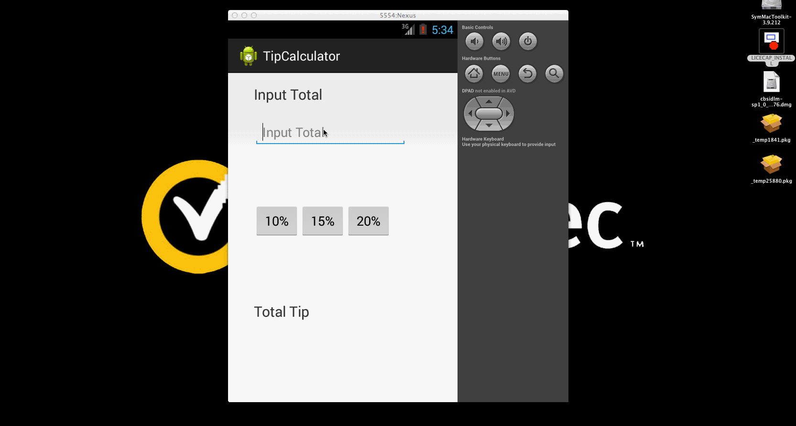

# Android Tip Calculator Project 

This is an Android pplication for calculate tips based on the bill amount.

Time spent: 3 hours spent in total

Completed user stories:

 * [x] Required: User is displayed the tip of specified percentage for specified entered amount  
 * [x] Required: User enters the total amount of the transaction
 * [x] Required: User can select between tip amounts (i.e 10%, 15%, 20%)
 * [x] Required: Upon selecting tip amount, formatted tip value is displayed
 * [x] Optional: 
 * [x] Optional: 

Notes:

Spent some time making the UI work 

Walkthrough of all user stories:

GIF created with [LiceCap](http://www.cockos.com/licecap/).

